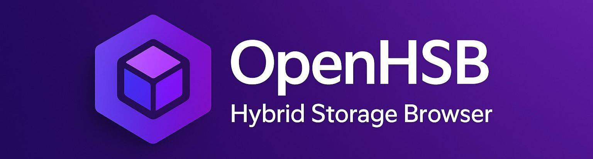

# Infimount — Hybrid Storage Browser

<p align="center">
  
  </p>

Infimount is an **open hybrid storage browser** designed to give you a single, consistent UI for browsing many different kinds of storage backends.  
Under the hood it is powered by **[Apache OpenDAL](https://opendal.apache.org/)**, which provides a unified API over dozens of services.

- Today the desktop app focuses on local filesystem browsing, built on OpenDAL’s `fs` backend.
- The architecture already has placeholders for **S3, Azure Blob, WebDAV and other cloud/object stores**, which will be enabled as soon as their corresponding OpenDAL builders are wired into `infimount_core`.
- The goal is to make jumping between “local disk”, “cloud bucket”, and “remote storage” feel like switching tabs in a single explorer.

## 🧩 Architecture Overview

[](LICENSE)
[](CODE_OF_CONDUCT.md)
[](https://github.com/infimount/infimount/actions/workflows/ci.yml)

Infimount is designed to be modular and minimal:

```
   ┌───────────────────────┐
   │     React Frontend    │  (UI/UX, Typescript)
   └────────────▲──────────┘
                │ invoke()
   ┌────────────┴──────────┐
   │     Tauri Backend     │  (bridges UI ↔ Core)
   └────────────▲──────────┘
                │ Rust API
   ┌────────────┴──────────┐
   │  infimount_core (Rust)│  ← Operator registry, config, OpenDAL calls
   │      + OpenDAL        │
   └───────────────────────┘
```

### 🧱 Core Principles
- **No reinventing storage logic** → All heavy lifting is done by OpenDAL.  
- **Thin, clean Rust core** → A tiny layer that only selects the right operator.  
- **UI never interacts with storage directly** → All operations go through Tauri commands.

---

## 📦 Project Structure

```
infimount/
├── crates/
│   └── core/              # Rust core: operators, config, models, ops
├── apps/
│   └── desktop/           # Tauri desktop app (Rust + React)
│       ├── src            # React UI
│       └── src-tauri      # Rust bridge to infimount_core
└── README.md
```

For more internal guidelines, see **Agents.md**.

---

## 🛠️ Building From Source

### 1. Install Prerequisites
- Rust (latest stable)
- Node.js + pnpm
- Tauri OS dependencies:
  - Linux: GTK / WebKitGTK stack (see Tauri docs)
  - macOS: Xcode tools
  - Windows: MSVC toolchain

### 2. Install JS deps
```bash
cd apps/desktop
pnpm install
```

### 3. Run Dev Mode
```bash
cd apps/desktop
pnpm dev
pnpm tauri dev
```

### 4. Build Release (Desktop)
```bash
cd apps/desktop
pnpm build        # build React frontend → apps/dist
pnpm tauri build  # bundle Tauri app (deb/rpm/exe/app etc.)
```

This will produce native bundles in `target/release/bundle/` (platform‑specific) and a release binary at `target/release/infimount`.

> For detailed, per‑platform steps (Linux, Windows, macOS, iOS) and icon notes, see `build.md`.

---

## 🎯 Roadmap

- [ ] Add multi-tab browsing  
- [ ] Grid/list view toggle  
- [ ] Rich previews (images, PDFs, parquet)  
- [ ] Drag-and-drop file operations  
- [ ] Mobile version (Tauri Mobile)  
- [ ] CLI companion (`infimount-cli`)  
- [ ] Remote agent mode  

---

## 🤝 Contributing

Contributions are welcome!
Please read our [Contributing Guide](CONTRIBUTING.md) and [Code of Conduct](CODE_OF_CONDUCT.md) before submitting a Pull Request.

Also check out:
➡ **Agents.md**

It describes how assistants (and humans) should extend the system without breaking architecture.

---

## 📄 License

MIT License.

---

## ⭐ Acknowledgements

- **Apache OpenDAL** — for powering the multi-backend magic  
- **Tauri** — for a lightweight native shell  
- **React + TypeScript** — for a smooth developer experience
