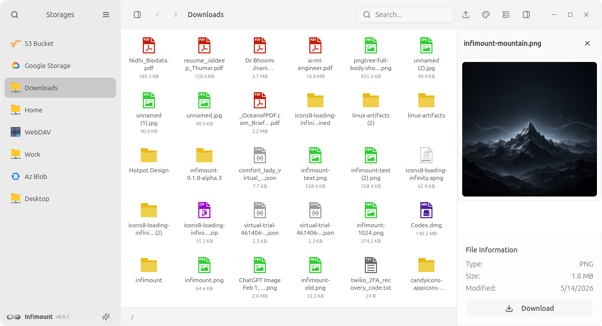

<p align="center">
  
</p>

<p align="center">
  <strong>Unified Storage Browser</strong><br/>
  Browse local and cloud storage through a single interface.
</p>

<p align="center">
  
</p>


> 🔐 **LOCAL-FIRST BY DEFAULT**
>
> Infimount stores your storage sources, app config, and credentials on your own machine.
> Default path: `~/.infimount/config.json` (or override via `INFIMOUNT_CONFIG`).
> No Infimount-hosted backend is required.

<p align="center">
  <a href="LICENSE"></a>
  <a href="CODE_OF_CONDUCT.md"></a>
  <a href="https://github.com/infimount/infimount/actions/workflows/ci.yml"></a>
  <a href="https://github.com/infimount/infimount/releases"></a>
  <a href="https://github.com/sponsors/infimount"></a>
</p>

---

## ✨ Features

- 🗂️ **Unified File Browser** — Browse local files, S3, Azure Blob, GCS, and WebDAV from one app
- 🔐 **Local-First Storage of Config + Credentials** — Sources and credentials persist locally on your machine
- 🖼️ **Rich Previews** — View images, text files, and documents inline
- 📁 **Grid & List Views** — Switch between visual layouts
- 🔄 **Drag & Drop** — Upload files by dropping them into any storage
- ⚡ **Fast & Native** — Built with Tauri + Rust for minimal resource usage
- 🎨 **Modern UI** — Dark mode, keyboard shortcuts, and polished UX

## 📥 Installation

### Download

Pre-built binaries for **Linux**, **macOS**, and **Windows** are available on:

- GitHub Pages download hub: [infimount.github.io/infimount](https://infimount.github.io/infimount/)
- Releases page: [github.com/infimount/infimount/releases](https://github.com/infimount/infimount/releases)

**Current stable release:** [Latest Release](https://github.com/infimount/infimount/releases/latest)

| Platform | Download Link (`latest stable`) | Format |
|----------|----------------------|--------|
| Linux (Debian/Ubuntu) | [Infimount-amd64.deb](https://github.com/infimount/infimount/releases/latest/download/Infimount-amd64.deb) | `.deb` |
| Linux (Fedora/RHEL) | [Infimount-x86_64.rpm](https://github.com/infimount/infimount/releases/latest/download/Infimount-x86_64.rpm) | `.rpm` |
| Linux (Universal) | [Infimount-x86_64.AppImage](https://github.com/infimount/infimount/releases/latest/download/Infimount-x86_64.AppImage) | `.AppImage` |
| macOS | [Infimount.dmg](https://github.com/infimount/infimount/releases/latest/download/Infimount.dmg) | `.dmg` |
| Windows (Installer) | [Infimount.msi](https://github.com/infimount/infimount/releases/latest/download/Infimount.msi) | `.msi` |
| Windows (NSIS) | [Infimount-setup.exe](https://github.com/infimount/infimount/releases/latest/download/Infimount-setup.exe) | `.exe` |

> ℹ️ **Tip:** Use assets from the **GitHub Release page**.
> The `linux-artifacts.zip` from Actions is a temporary CI artifact and is not the canonical public download link.

> 🔐 **Integrity:** Every release includes `SHA256SUMS.txt` and per-file `.sha256` assets.
> After download, verify with:
> `sha256sum -c SHA256SUMS.txt`

> ⚠️ **Note**: macOS/Windows binaries may be unsigned for some releases. See [Installation Notes](#installation-notes) below.

### Quick First Run (After Download)

1. Linux (`.AppImage`)
   `chmod +x Infimount-*.AppImage && ./Infimount-*.AppImage`
2. Linux (`.deb`)
   `sudo apt install ./Infimount-amd64.deb`
3. Linux (`.rpm`)
   `sudo rpm -i Infimount-x86_64.rpm`
4. macOS (`.dmg`)
   Open DMG, drag Infimount to Applications, then right-click app -> `Open` on first launch.
5. Windows (`.msi` or `.exe`)
   Run installer. If SmartScreen appears: `More info` -> `Run anyway`.

### Build from Source

See [Building from Source](#️-building-from-source) section below.

### Install with Homebrew (macOS and Linux)

```bash
brew tap infimount/infimount
# Linux (formula)
brew install infimount

# macOS (cask)
brew install --cask infimount
```

Upgrade later with:

```bash
brew update
brew upgrade infimount
brew upgrade --cask infimount
```

### Upgrade to a New Release

If you installed from release binaries (not Homebrew), upgrade like this:

1. Linux (`.deb`)
   `sudo apt install ./Infimount-amd64.deb`
2. Linux (`.rpm`)
   `sudo rpm -Uvh ./Infimount-x86_64.rpm`
3. Linux (`.AppImage`)
   Download the latest AppImage, replace your old file, then run:
   `chmod +x Infimount-*.AppImage && ./Infimount-*.AppImage`
4. macOS (`.dmg`)
   Download latest DMG and replace `Infimount.app` in Applications.
5. Windows (`.msi` or `.exe`)
   Run the latest installer; it upgrades the existing install.

---

## 📦 Supported Storage Backends

| Backend | Status | Notes |
|---------|--------|-------|
| **Local Filesystem** | ✅ Stable | Full read/write support |
| **Amazon S3** | ✅ Stable | Any S3-compatible service |
| **Azure Blob Storage** | ✅ Stable | Container/account key auth |
| **Google Cloud Storage** | ✅ Stable | Service account JSON |
| **WebDAV** | ✅ Stable | Nextcloud, ownCloud, etc. |
| **SFTP** | 🔜 Planned | Coming soon |
| **FTP** | 🔜 Planned | Coming soon |

---

## 🛠️ Building from Source

### Prerequisites

- **Rust** (latest stable) — [rustup.rs](https://rustup.rs/)
- **Node.js 18+** and **pnpm** — [pnpm.io](https://pnpm.io/installation)
- **Tauri dependencies** — [Platform-specific setup](https://tauri.app/start/prerequisites/)

### Quick Start

```bash
# Clone the repository
git clone https://github.com/infimount/infimount.git
cd infimount

# Install frontend dependencies
cd apps/desktop
pnpm install

# Run in development mode
pnpm tauri dev
```

### Build for Production

```bash
cd apps/desktop
pnpm build          # Build React frontend
pnpm tauri build    # Bundle native app
```

Outputs:
- **Linux**: `target/release/bundle/deb/`, `bundle/rpm/`, `bundle/appimage/`
- **macOS**: `target/release/bundle/dmg/`, `bundle/macos/`
- **Windows**: `target/release/bundle/msi/`, `bundle/nsis/`

> 📖 For detailed platform-specific instructions, see [build.md](build.md).
> For release operations and checklist, see [docs/releasing.md](docs/releasing.md).

---

## 🎯 Roadmap

### Current Focus (v0.1.x)
- [x] Local filesystem browsing
- [x] S3/Azure/GCS/WebDAV backends
- [x] Grid and list views
- [x] File preview panel
- [x] Drag-and-drop uploads
- [ ] Multi-tab browsing
- [ ] Keyboard navigation

### Future Plans
- [ ] Additional storage backends (SFTP, FTP, etc.)
- [ ] MCP support for integration with AI assistants
- [ ] Improved performance for large directories
- [ ] CLI companion (`infimount-cli`)
- [ ] Mobile app (iOS/Android)
- [ ] Hosted and managed deployment options

---

## 🤝 Contributing

We welcome contributions! Please read:

- [CONTRIBUTING.md](CONTRIBUTING.md) — How to contribute
- [CODE_OF_CONDUCT.md](CODE_OF_CONDUCT.md) — Community standards
- [GOVERNANCE.md](GOVERNANCE.md) — Decision-making process
- [Agents.md](Agents.md) — Guidelines for AI assistants

### Development Commands

```bash
# Run tests
cd apps/desktop && pnpm test        # Frontend tests
cargo test --workspace               # Rust tests

# Lint & format
pnpm lint                            # ESLint
cargo fmt --check                    # Rust formatting
cargo clippy                         # Rust lints

# Enable local pre-commit checks (yamllint, markdownlint, actionlint)
pnpm setup:hooks
```

---

## 💖 Support the Project

If Infimount is useful to you, consider supporting its development:

<p align="center">
  <a href="https://github.com/sponsors/infimount">
    
  </a>
</p>

Your sponsorship helps:
- Maintain and improve the codebase
- Add new storage backends
- Keep Infimount free and open source

---

## 📝 Installation Notes

### macOS
Binaries may be unsigned/not notarized in some releases. To open:
1. Open the `.dmg`
2. Drag `Infimount.app` to `Applications`
3. Right-click the app and select `Open`
4. Click `Open` in the dialog

### Windows
SmartScreen may block the installer. Click `More info` -> `Run anyway`.

### Linux
AppImage needs executable permission:
```bash
chmod +x Infimount-*.AppImage
./Infimount-*.AppImage
```

---

## 📄 License

[MIT License](LICENSE) — Copyright © 2026 Infimount Contributors

---

## ⭐ Acknowledgements

- **[Apache OpenDAL](https://opendal.apache.org/)** — Unified storage access layer
- **[Tauri](https://tauri.app/)** — Lightweight native app framework
- **[React](https://react.dev/)** + **[TypeScript](https://www.typescriptlang.org/)** — Modern frontend stack
- **[File Icons](https://github.com/dmhendricks/file-icon-vectors/)** — File Icons by Dan Hendricks

---

<p align="center">
  Made with ❤️ by the Infimount community
</p>
