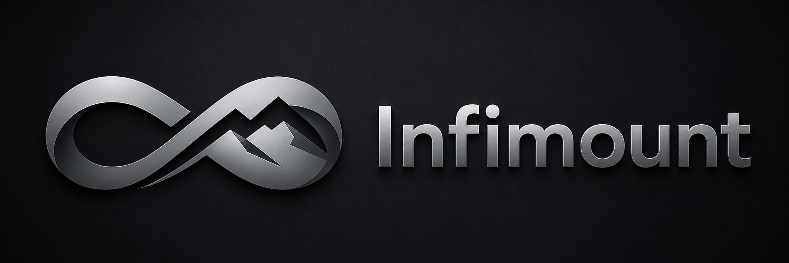
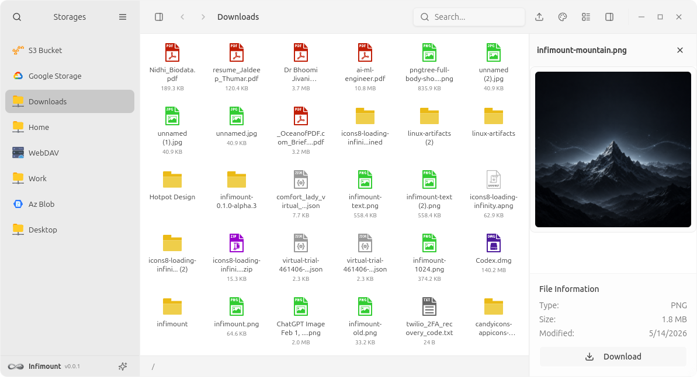

<p align="center">
  
</p>

<p align="center">
  <strong>Governed data access for AI agents.</strong><br/>
  One surface across local and cloud storage. Prepare only the data an agent needs, keep its work scoped, and review exactly what may be written back.
</p>

<p align="center">
  <a href="LICENSE"></a>
  <a href="CODE_OF_CONDUCT.md"></a>
  <a href="https://github.com/infimount/infimount/actions/workflows/ci.yml"></a>
  <a href="https://github.com/infimount/infimount/releases"></a>
  <a href="https://github.com/sponsors/infimount"></a>
</p>

<p align="center">
  
</p>

> **Local-first by default**
>
> Infimount stores storage sources, app config, MCP settings, and credentials on your machine.
> Default storage registry: `~/.infimount/storages.json`.
> MCP runtime settings: `~/.infimount/mcp_settings.json`.
> No Infimount-hosted backend is required.

## Install

**Current stable release:** [v0.8.1](https://github.com/infimount/infimount/releases/tag/v0.8.1)


### Linux

```bash
curl -fsSL https://github.com/infimount/infimount/releases/latest/download/install.sh | sh
```

The script verifies checksums and chooses `.deb`, `.rpm`, or AppImage automatically. Override with `INFIMOUNT_INSTALL_FORMAT=deb|rpm|appimage`.

Manual downloads:

- [DEB for Debian/Ubuntu](https://github.com/infimount/infimount/releases/latest/download/Infimount-amd64.deb)
- [RPM for Fedora/RHEL](https://github.com/infimount/infimount/releases/latest/download/Infimount-x86_64.rpm)
- [AppImage for portable use](https://github.com/infimount/infimount/releases/latest/download/Infimount-x86_64.AppImage)

### macOS

```bash
curl -fsSL https://github.com/infimount/infimount/releases/latest/download/install.sh | sh
```

Or use Homebrew:

```bash
brew tap infimount/infimount
brew install --cask infimount
```

Manual download: [Infimount.dmg](https://github.com/infimount/infimount/releases/latest/download/Infimount.dmg)

### Windows

Run in PowerShell:

```powershell
irm https://github.com/infimount/infimount/releases/latest/download/install.ps1 | iex
```

Manual downloads:

- [MSI installer](https://github.com/infimount/infimount/releases/latest/download/Infimount.msi)
- [Setup EXE](https://github.com/infimount/infimount/releases/latest/download/Infimount-setup.exe)

### Install notes

Install scripts verify selected downloads against `SHA256SUMS.txt`. Pin this stable release with `INFIMOUNT_VERSION=v0.8.1`; `latest` installs the current stable release. On Linux, the installer warns when another `infimount` earlier in `PATH` would shadow the executable that was just installed. Every release requires signed updater artifacts. Platform application signing is included when credentials are configured; this project may publish explicitly platform-unsigned stable or prerelease packages, which can trigger operating-system warnings.

## What Infimount does

- **Browse storage in one place:** local files, S3/S3-compatible storage, Backblaze B2, Aliyun OSS, Tencent COS, Huawei OBS, Azure Blob, Google Cloud Storage, Google Drive, Microsoft OneDrive, WebDAV, and SFTP.
- **Work like a desktop file manager:** grid and list views, rich previews, drag-and-drop upload, bookmarks, recents, keyboard navigation, global search stop, dual-pane transfer workflows, conflict handling, and transfer queue.
- **Validate before you trust a backend:** reachability checks report grouped capabilities, sanitized fix hints, and MCP readiness notes.
- **Control agent access explicitly:** new storages are not exposed to MCP by default. Enable selected storages, tool lists, path policies, read-only mode, confirmations, and local audit logs.
- **Govern agent data ingress:** Agent Tasks copy only explicitly selected source files into a bounded local workspace without mutating the source or broadening its MCP exposure.
- **Govern agent data egress:** generated outputs remain inside the task workspace until the user reviews their bytes and hashes, selects what may leave, approves an exact destination plan, and publishes with create-only writes.
- **Stay backend-agnostic:** storage I/O routes through Apache OpenDAL so the authorization and publication model remains independent of provider-specific SDK paths.

## Product direction

Infimount is evolving from a unified storage browser with MCP controls into a **governed data plane between systems of record and autonomous agent environments**. The file browser remains an important human control surface, but the durable product boundary is the flow around agent work:

`select → snapshot/hash → scoped workspace → agent → review → approved publication → receipt`

Infimount does **not** aim to become a built-in model runtime, generic MCP gateway, semantic/RAG platform, or replacement for provider-native MCP servers. It should integrate with those systems while owning cross-storage data scope, provenance, review, and write-back safety.

## Workbench

Infimount includes daily file-manager workflows beyond basic browsing:

- Dual-pane copy, move, compare, and update flows across supported storages.
- Transfer queue with queued/running/completed/failed states, retry, active or queued cancellation, progress visibility, and persisted transfer history.
- Conflict handling for overwrite, discard, or keep-both transfers.
- Bookmarks, recent folders, drag-and-drop upload, rich preview, and roving keyboard navigation in grid/table views.
- Opt-in global search indexing with a Stop control so stale slow-storage responses do not overwrite newer UI state.

## Agent Workspaces

Agent Workspaces define a safer storage-scoped MCP boundary for agents and Agent Tasks:

- Create a plain workspace by choosing a name and storage. Infimount derives `/agent-workspaces/<name>` inside that storage and shows the storage-relative location instead of asking for a second host path.
- Apply a managed workspace-scoped MCP policy automatically. New workspaces are read-only for agents unless the desktop user explicitly opts into writes.
- Persist Local Filesystem workspace namespaces as canonical absolute host paths. Legacy browsing roots such as `~` and `~/projects` are accepted and normalized once at first workspace binding; shell-variable forms such as `$HOME/...` remain invalid.
- Keep older current-schema template memory files and checkpoints available as compatibility behavior for existing workspaces; new workspace creation no longer asks for coding, research, or data-analysis agent types.
- Review workspace activity grouped from local events and MCP audit events that fall under the workspace root.
- Bind each workspace to the storage namespace it references; changing the storage namespace or removing the storage while workspaces are bound is blocked until the workspaces are recreated.

## Agent Tasks

Agent Tasks are included in stable v0.8.1. Before stable promotion, the release completed real coding, document, and data-analysis pilot validation plus the focused rc.14 compatibility regression for legacy `~` source preparation and the current Codex MCP handoff.

- Prepare only the files selected in the File Browser into a bounded `tasks/<uuid>/inputs/` snapshot. Preparation never moves or mutates the source and never grants new MCP access to it.
- Use an explicitly read-write Local Filesystem Agent Workspace for task outputs. Read-write workspace creation is a separate desktop opt-in.
- Launch the prepared task in Codex through the existing Infimount MCP integration rather than giving Codex a second storage-access path.
- Review files under `outputs/` with byte size, SHA-256, and bounded previews before deciding what may leave the task workspace.
- Publish nothing by default. The desktop user selects outputs, destination storage, destination folder, and either **fail** or **rename** conflict handling, then approves an exact publication preview.
- Publish with OpenDAL create-only writes and re-verify source and committed destination hashes. Agent Task publication has no overwrite mode.
- Write a unique create-only `publish-receipt-<publication-id>.json` after each fully successful publication. Partial multi-file failures surface cleanup-required state rather than pretending the operation was atomic.

See the [Agent Tasks contract](docs/agent-tasks.md) for the complete safety model, limits, and known local-filesystem TOCTOU boundary.

## First run and upgrades

GitHub shows a copy button on each fenced command block in this README.

Linux AppImage:

```bash
chmod +x Infimount-*.AppImage
./Infimount-*.AppImage
```

Linux DEB:

```bash
sudo apt install ./Infimount-amd64.deb
```

Linux RPM:

```bash
sudo rpm -i Infimount-x86_64.rpm
```

macOS DMG: open the DMG and drag Infimount to Applications. Platform-signed releases are notarized when Apple credentials are configured. For an explicitly platform-unsigned release, expect Gatekeeper warnings and use the documented per-app approval path only after verifying the release checksums and provenance; never disable Gatekeeper globally.

Windows MSI or EXE: run the installer. Authenticode signing is included when Windows credentials are configured. For an explicitly platform-unsigned release, expect SmartScreen warnings and verify checksums, provenance, and the release signing status before proceeding.

Upgrade by running the latest installer again. For Homebrew installs:

```bash
brew update
brew upgrade infimount
brew upgrade --cask infimount
```

## Build from source

See [Building from Source](#️-building-from-source) below.

---

## Supported Storage Backends

| Backend                         | Status     | Notes                                                                       |
| ------------------------------- | ---------- | --------------------------------------------------------------------------- |
| **Local Filesystem**            | ✅ Stable  | Full read/write support                                                     |
| **Amazon S3 / S3-compatible**   | ✅ Stable  | Any S3-compatible service; versioning depends on bucket support; optional default object ACL |
| **Backblaze B2**                | ✅ Stable  | Native OpenDAL B2 backend with read/write/list/delete, copy, presign, and capability-gated user metadata writes |
| **Aliyun OSS**                  | ✅ Stable  | Object storage via OpenDAL; read/write/list/delete/copy and presigned links; no generic rename/create-dir capability |
| **Tencent COS**                 | ✅ Stable  | Object storage via OpenDAL; read/write/list/delete/copy and presigned links; no generic rename/create-dir capability |
| **Huawei OBS**                  | ✅ Stable  | Object storage via OpenDAL; read/write/list/delete/copy and presigned links; no generic rename/create-dir capability |
| **Azure Blob Storage**          | ✅ Stable  | Container/account key auth; advanced capabilities depend on account support |
| **Google Cloud Storage**        | ✅ Stable  | Service account JSON; advanced capabilities depend on bucket support        |
| **WebDAV**                      | ✅ Stable  | Nextcloud, ownCloud, etc.; optional compatibility mode for servers that cannot create collection placeholders |
| **SFTP**                        | ✅ Stable  | Linux/macOS only; key-based SFTP via OpenDAL. Password login is intentionally not exposed because OpenDAL SFTP does not support it |
| **FTP**                         | ⏸ Disabled | Temporarily disabled in v0.8 due to an upstream command-injection vulnerability; may return after a fixed OpenDAL release |

Use **Validate** in Add/Edit Storage to check reachability, grouped capability summaries, sanitized fix hints, and MCP readiness notes before browsing or exposing a storage to agents.
For MCP/versioning details, see [Backend Capability Matrix](docs/backend-capabilities.md).

---

## 🤖 MCP Integration

Infimount includes a Rust MCP server for local AI clients and agent workflows.

- Transports: stdio and Streamable HTTP
- HTTP auth: bearer token required for non-loopback desktop HTTP and for headless HTTP unless explicitly started in loopback-only insecure dev mode
- Scoped access: new storages are not exposed to MCP by default; expose only selected storages, disable individual MCP tools, and restrict storage paths with allow/deny prefixes
- Risk controls: write/delete/presign/version-delete operations can require approval in Infimount before execution
- Audit trail: local bounded MCP audit log records allowed, denied, confirmed, and failed tool activity without storing secrets or presigned URL signatures
- Version-aware tools: supported where the backend and storage configuration support object versions; version listing and `write_file` are bounded (10,000 scanned/1,000 per page and 4 MiB respectively)

Setup guide: [MCP Client Setup](docs/mcp-client-setup.md)

Agent integration guide: [Agent Integrations](docs/agent-integrations.md)

Security model: [Security Model](docs/security.md)

Operational guides: [Agent Workspaces](docs/agent-workspaces.md), [Agent Tasks](docs/agent-tasks.md), [Recovery](docs/recovery.md), [Privacy](docs/privacy.md), and [Troubleshooting](docs/troubleshooting.md)

---

## 🛠️ Building from Source

### Prerequisites

- **Rust 1.94+** — [rustup.rs](https://rustup.rs/) (the pinned workspace toolchain and current MSRV)
- **Node.js 24** and **pnpm 10** — [pnpm.io](https://pnpm.io/installation)
- **Tauri dependencies** — [Platform-specific setup](https://tauri.app/start/prerequisites/)

### Quick Start

```bash
# Clone the repository
git clone https://github.com/infimount/infimount.git
cd infimount

# Install frontend dependencies
cd apps/desktop
pnpm install

# Run in development mode
pnpm tauri dev
```

### Build for Production

```bash
cd apps/desktop
pnpm build          # Build React frontend
pnpm tauri build    # Bundle native app
```

Outputs:

- **Linux**: `target/release/bundle/deb/`, `bundle/rpm/`, `bundle/appimage/`
- **macOS**: `target/release/bundle/dmg/`, `bundle/macos/`
- **Windows**: `target/release/bundle/msi/`, `bundle/nsis/`

> 📖 For release operations and checklist, see [docs/releasing.md](docs/releasing.md).
> For Google Drive and Microsoft OneDrive setup, see [docs/oauth-drive-setup.md](docs/oauth-drive-setup.md).
> To verify public download links before announcing a release, run `scripts/check-release-links.sh`.

---

## 🎯 Roadmap

### Shipped foundation

- [x] Cross-storage browsing for local files, major object stores, Google Drive, OneDrive, WebDAV, and SFTP
- [x] Native file-manager workflows, previews, transfer queue, dual-pane copy/move, bookmarks, and recents
- [x] Explicit MCP storage exposure, path policy, tool controls, sessions, confirmations, and local audit
- [x] Native secret storage, recovery, diagnostics, OAuth-backed Drive/OneDrive, and packaged sidecar
- [x] Agent Tasks in v0.8.1: bounded source preparation, task-scoped MCP, Codex handoff, reviewed outputs, create-only publication, destination verification, and receipts
- [x] Real coding, document, and data-analysis pilot evidence plus the final rc.14 compatibility regression

### v0.8.2 active feature train

- [ ] Make the Agent Task contract agent-neutral; Codex becomes one adapter rather than the product model
- [ ] Add first-class adapters for additional agent clients, prioritizing Claude Code, Gemini CLI, OpenCode/Pi, and other MCP-capable clients
- [ ] Add a headless CLI/API for prepare, inspect, review, approve, publish, and evidence workflows without bypassing desktop policy
- [ ] Add MCP Apps-compatible review/publish UI where agent hosts support interactive MCP resources
- [ ] Add sandbox-provider adapters so isolated runtimes can receive bounded task data while Infimount retains ingress/egress control
- [ ] Strengthen portable policy, agent identity, provenance, audit, and observability contracts
- [ ] Continue large-directory, storage-capability, and platform reliability work where it supports the governed-data-plane workflow

**Versioning:** v0.8.2 is the active feature line. No v0.9 release is planned for roughly the next year; the product will continue to deepen the v0.8 architecture rather than using a version jump as a roadmap milestone.

### Explicit non-priorities

- Mobile apps
- A built-in AI/model runtime
- A generic MCP gateway or marketplace
- A semantic/vector/RAG platform
- Provider-specific replacements for Google, Box, Dropbox, or other native MCP servers
- A hosted multi-user control plane before the local/headless data-plane contract is proven

---

## 🤝 Contributing

We welcome contributions! Please read:

- [CONTRIBUTING.md](CONTRIBUTING.md) — How to contribute
- [CODE_OF_CONDUCT.md](CODE_OF_CONDUCT.md) — Community standards
- [GOVERNANCE.md](GOVERNANCE.md) — Decision-making process
- [Agents.md](Agents.md) — Guidelines for AI assistants

### Development Commands

```bash
# Run tests
cd apps/desktop && pnpm test        # Frontend tests
cargo test --workspace               # Rust tests

# Lint & format
pnpm lint                            # ESLint
cargo fmt --check                    # Rust formatting
cargo clippy                         # Rust lints

# Enable local pre-commit checks (yamllint, markdownlint, actionlint)
pnpm setup:hooks
```

---

## 💖 Support the Project

If Infimount is useful to you, consider supporting its development:

<p align="center">
  <a href="https://github.com/sponsors/infimount">
    
  </a>
</p>

Your sponsorship helps:

- Maintain and improve the codebase
- Add new storage backends
- Keep Infimount free and open source

---

## 📝 Installation Notes

### macOS

Platform-signed releases are signed and notarized when the corresponding credentials are configured. Platform-unsigned stable or prerelease packages may trigger Gatekeeper or SmartScreen warnings; never treat them as notarized or Authenticode-signed. Updater artifacts remain cryptographically signed; verify checksums, provenance, and the release's explicit signing status before installing.

### Windows

MSI and EXE installers are Authenticode-signed only when Windows signing credentials are configured. For platform-unsigned releases, expect SmartScreen warnings and do not treat the installer as Authenticode-authenticated. Updater artifacts remain cryptographically signed.

### Linux

AppImage needs executable permission:

```bash
chmod +x Infimount-*.AppImage
./Infimount-*.AppImage
```

---

## 📄 License

[MIT License](LICENSE) — Copyright © 2026 Infimount Contributors

---

## ⭐ Acknowledgements

- **[Apache OpenDAL](https://opendal.apache.org/)** — Unified storage access layer
- **[Tauri](https://tauri.app/)** — Lightweight native app framework
- **[React](https://react.dev/)** + **[TypeScript](https://www.typescriptlang.org/)** — Modern frontend stack
- **[File Icons](https://github.com/dmhendricks/file-icon-vectors/)** — File Icons by Dan Hendricks

---

<p align="center">
  Made with ❤️ by the Infimount community
</p>

> **Security boundary:** local MCP operations reject symlink and reparse-point
> components. Built-in MCP HTTP is loopback-only; use a TLS reverse proxy for
> remote deployments.